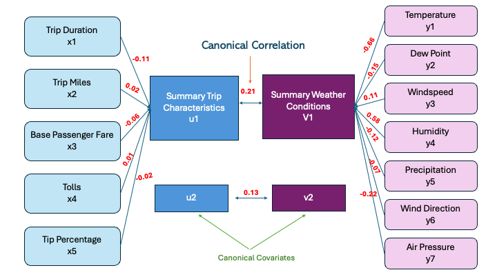

## 1. **Principal Component Analysis (PCA)**
Initially, three separate principal component analyses were conducted for different times of the day—morning, noon, and evening—excluding tipping variables. Since no significant differences were observed across the time periods, a combined principal component analysis was performed without considering time, while still excluding the tipping variables. This allowed for the regression of tips against the important principal components identified, leading to the following observations.

### a. **Key Principal Components**
To identify the most important principal components, a scree plot was first generated.

- **Visualization**:

  

- **Interpretation**:
  
 The scree plot shows that the first principal component accounts for 37.1% of the variance, while the second accounts for 11%. Based on the "elbow" in the plot, only the first two principal components need to be kept when performing principal component regression.

### b. Analyzing the Variables within the Principal Components
After selecting the first two principal components, the next step is to identify which variables play a significant role in these components. This can be examined through a biplot and bar plot, which highlight the contribution of each variable to the first two principal components.

- **Visualization**:
  

 
 

- **Interpretation**:

  The biplot and loadings together provide a detailed information of the key factors influencing the variability in the dataset.

  Starting with PC1, the loadings plot shows that variables like trip distances, duration, base fare, black car fund fee, and driver pay have the largest negative contributions. This aligns with the biplot, where arrows representing these variables point are far from zero in the direction of PC1, indicating their strong influence on this component. The high loadings suggest that PC1 is primarily driven by trip related variables, meaning longer trips, higher fares, and additional charges such as sales tax and driver pay are key factors contributing to the variation in PC1.

  In PC2, the loadings plot indicates that wind speed, wind direciton, tolls charged during, and congestion surcharge have the strongest positive contributions. In the biplot, windspeed and tolls charged are far from the origin in the direction of PC2, confirming their role as key drivers of variability in this component. This suggests that PC2 captures variability related to external factors like weather and tolls/congestion perhaps indicating different patterns of demand depending on weather conditions and traffic conditions.

### c. Principal Component Regression
The Principal Component Regression (PCR) model was used to examine the relationship between tipping behavior and the first two principal components.

- **Visualization**:

  

 
- **Interpretation**:
  
  The Principal Component Regression model provided a simplified view of how tipping percentage relates to broader factors like trip characteristics and weather conditions (summarized by the principal components). However, the diagnostic plots reveal shortcomings, including non-linearity, heteroscedasticity, and non-normal residuals. To improve the model, further steps such as applying transformations could help better capture the relationship between tipping percentage and the underlying factors.

---
## 2. **Canonical Correlation Analysis**
Canonical Correlation Analysis (CCA) was used to explore the relationship between weather conditions (temperature, dew point, windspeed, humidity, precipitation, wind direction, and air pressure) and trip characteristics (trip duration, trip distance, base fare, toll charges, and tip percentage). The analysis revealed the following:

### a. **Visualizing Cross-Correlation** 
The cross-correlation matrix was examined to observe potential correlations within each category—weather conditions and trip characteristics—as well as the cross-correlations between them.

- **Visualization**:

- **Interpretation**:

X Correlation Matrix:  Among the weather variables, there is a strong positive correlation between (temperature and dew point) and (dew point and humidity), as indicated by the dark red, which is expected given that these variables often go together. In contrast, wind speed shows negative correlations with other weather factors like relative humidity (rhum) and air pressure (pres), as seen by the blue sqaures.

Y Correlation Matrix: For the trip characteristics, strong positive correlations are observed between trip miles, trip distances, and base passenger fare, which makes intuitive sense since longer trips typically result in higher fares. However, tip percentage shows weaker correlations with the other trip-related variables, suggesting that tipping behavior is less influenced by trip distance or fare.

The cross-correlation between weather and trip variables is weak, as shown by the green squares. This suggests that weather conditions, such as temperature, wind speed, and humidity, has weak association with  trip duration, distance, fare, or tipping percentage. 

### b. **Visualizing the Canonical Covariates**
Although the cross-correlation between the two sets of variables (weather conditions and trip characteristics) was weak, canonical covariates were still calculated to further explore the relationships. The CCA bar plots were examined to visualize how the first two pairs of canonical variates relate to each other.

- **Visualization**:

- **Interpretation**:
  
  Since u1 is heavily influenced by dew point and relative humidity, and v1 is driven by trip duration and base fare, this suggests that higher humidity and dew point might be associated with longer trip durations and higher base fares. 

The second pair of canonical variates(right) shows that u2 is influenced primarily by wind speed and air pressure, while v2 is driven by tolls, base fare, and tip percentage. This suggests that certain weather conditions, like higher wind speeds and air pressure, might be related to higher tolls or tipping percentages, though the strength of this relationship is quite weak.

### c.Overall correlation Structure
After visualizing the barplots, we calculated the canonical correlations to see how much the covariates are associated. We performed a test for the signifcance of the correlations and found the first two canonical pairs were signficant and should be explored as we had done above. 

- **Visualization**:

- **Interpretation**:

---
## 3. Visualizing Pickup/Dropoff Locations

### a. Pickup Location Trends
The first two principal components consistently explain a significant portion of the variance (around 46-48%)

- **Visualization**:

- **Interpretation**:
  The Screeplot above clearly shows... 

### b. Dropoff Location Trends
The first two principal components consistently explain a significant portion of the variance (around 46-48%)

- **Visualization**:

- **Interpretation**:
  The Screeplot above clearly shows...
---
