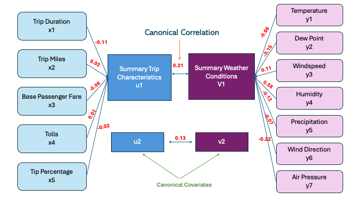

# Exploring 2023 NYC Taxi Demand Patterns

## Project Overview
Ride-hailing services, including For-Hire Vehicles (FHVs) like taxis, have become an integral part of urban transportation in cities like New York. With unpredictable weather patterns in the city, there is interest in understanding how external factors like weather conditions influence ride-hailing demand. The motivation for this project is to better understand the FHV ride patterns and how weather might affect commuters who take those means of transportation based on time of day and location. 

- **Dataset**: [NYC FHV Trip Data](https://data.cityofnewyork.us/Transportation/2023-High-Volume-FHV-Trip-Data/u253-aew4/about_data)
- **Tools Used**: R, Python 
- **Statistical Methods**: Principal Component Analysis and Canonical Correlation Analysis

### Key Research Questions:
- How do weather conditions (e.g., temperature, precipitation, wind) affect the demand for FHV services in New York City?
- Are there specific zones or regions in the city where the impact of weather on demand is more pronounced?
- How does ride-hailing demand change across different times of the day under varying weather conditions?

## Navigation
- [Data Description](Data.md)
- [Methodology](Methodology.md)
- [Results and Visualizations](Results.md)
- [Conclusion](Conclusions.md)
- [Code and References](https://github.com/weij5678/NYC-Taxi/tree/main)
  
## Key Findings

- Longer trips with higher fares are contributors to FHV ride behavior, while weather and traffic conditions also influence ride demand, although to a lesser degree.
- There was a weak correlation between tipping and ride characterstics including trip duration, distance traveled, etc.
- CCA uncovered a weak relationship between weather conditions and trip characteristics

## Visualizations

---

## Future Work

Potential extensions of this analysis include:
- Improving the Regression Models
- Better Weather Data Integration
- Further Exploration of Spatial Patterns
- Rider Behavior and Economic Variables

